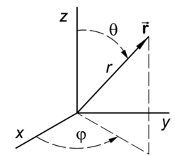

### 极坐标系
极坐标系如下图所示，其中0 < θ < π，注意所有同一纬度上的极坐标点的θ值均相同。0 < φ < 2π。极坐标转换到笛卡尔坐标系的计算方式为

z = r · cosθ

x = r · sinθ · cosφ

y = r · sinθ · sinφ

对于极坐标(r, θ, φ)，其所在射线与平面x = 1相交点的笛卡尔坐标为(1, tanφ, cotθ / cosφ)。




### 全景图

全景图的纹理u方向对应极坐标的经度（0~2π），v方向对应纬度（0~π）。使用全景图作为环境贴图进行采样时，需要将方向向量转为极坐标系坐标，再转为uv。建模软件里球体的uv也是用这种计算方式得到。下面计算用的是opengl坐标系，即y朝上，而非z朝上。

θ = acos(normal.z)

φ = atan2(normal.y, normal.x)

u = φ / 2π

v = θ / π

### Irradiance diffuse

将反射率方程的散射和折射部分分开写

<math xmlns="http://www.w3.org/1998/Math/MathML" display="block">
  <msub>
    <mi>L</mi>
    <mi>o</mi>
  </msub>
  <mo stretchy="false">(</mo>
  <mi>p</mi>
  <mo>,</mo>
  <msub>
    <mi>&#x03C9;<!-- ω --></mi>
    <mi>o</mi>
  </msub>
  <mo stretchy="false">)</mo>
  <mo>=</mo>
  <munder>
    <mo>&#x222B;<!-- ∫ --></mo>
    <mrow class="MJX-TeXAtom-ORD">
      <mi mathvariant="normal">&#x03A9;<!-- Ω --></mi>
    </mrow>
  </munder>
  <mo stretchy="false">(</mo>
  <msub>
    <mi>k</mi>
    <mi>d</mi>
  </msub>
  <mfrac>
    <mi>c</mi>
    <mi>&#x03C0;<!-- π --></mi>
  </mfrac>
  <mo stretchy="false">)</mo>
  <msub>
    <mi>L</mi>
    <mi>i</mi>
  </msub>
  <mo stretchy="false">(</mo>
  <mi>p</mi>
  <mo>,</mo>
  <msub>
    <mi>&#x03C9;<!-- ω --></mi>
    <mi>i</mi>
  </msub>
  <mo stretchy="false">)</mo>
  <mi>n</mi>
  <mo>&#x22C5;<!-- ⋅ --></mo>
  <msub>
    <mi>&#x03C9;<!-- ω --></mi>
    <mi>i</mi>
  </msub>
  <mi>d</mi>
  <msub>
    <mi>&#x03C9;<!-- ω --></mi>
    <mi>i</mi>
  </msub>
  <mo>+</mo>
  <munder>
    <mo>&#x222B;<!-- ∫ --></mo>
    <mrow class="MJX-TeXAtom-ORD">
      <mi mathvariant="normal">&#x03A9;<!-- Ω --></mi>
    </mrow>
  </munder>
  <mo stretchy="false">(</mo>
  <msub>
    <mi>k</mi>
    <mi>s</mi>
  </msub>
  <mfrac>
    <mrow>
      <mi>D</mi>
      <mi>F</mi>
      <mi>G</mi>
    </mrow>
    <mrow>
      <mn>4</mn>
      <mo stretchy="false">(</mo>
      <msub>
        <mi>&#x03C9;<!-- ω --></mi>
        <mi>o</mi>
      </msub>
      <mo>&#x22C5;<!-- ⋅ --></mo>
      <mi>n</mi>
      <mo stretchy="false">)</mo>
      <mo stretchy="false">(</mo>
      <msub>
        <mi>&#x03C9;<!-- ω --></mi>
        <mi>i</mi>
      </msub>
      <mo>&#x22C5;<!-- ⋅ --></mo>
      <mi>n</mi>
      <mo stretchy="false">)</mo>
    </mrow>
  </mfrac>
  <mo stretchy="false">)</mo>
  <msub>
    <mi>L</mi>
    <mi>i</mi>
  </msub>
  <mo stretchy="false">(</mo>
  <mi>p</mi>
  <mo>,</mo>
  <msub>
    <mi>&#x03C9;<!-- ω --></mi>
    <mi>i</mi>
  </msub>
  <mo stretchy="false">)</mo>
  <mi>n</mi>
  <mo>&#x22C5;<!-- ⋅ --></mo>
  <msub>
    <mi>&#x03C9;<!-- ω --></mi>
    <mi>i</mi>
  </msub>
  <mi>d</mi>
  <msub>
    <mi>&#x03C9;<!-- ω --></mi>
    <mi>i</mi>
  </msub>
</math>

提取散射部分的常量到积分号外面，此时积分号内的参数只和环境贴图有关，可以离线预渲染

<math xmlns="http://www.w3.org/1998/Math/MathML" display="block">
  <msub>
    <mi>L</mi>
    <mi>o</mi>
  </msub>
  <mo stretchy="false">(</mo>
  <mi>p</mi>
  <mo>,</mo>
  <msub>
    <mi>&#x03C9;<!-- ω --></mi>
    <mi>o</mi>
  </msub>
  <mo stretchy="false">)</mo>
  <mo>=</mo>
  <msub>
    <mi>k</mi>
    <mi>d</mi>
  </msub>
  <mfrac>
    <mi>c</mi>
    <mi>&#x03C0;<!-- π --></mi>
  </mfrac>
  <munder>
    <mo>&#x222B;<!-- ∫ --></mo>
    <mrow class="MJX-TeXAtom-ORD">
      <mi mathvariant="normal">&#x03A9;<!-- Ω --></mi>
    </mrow>
  </munder>
  <msub>
    <mi>L</mi>
    <mi>i</mi>
  </msub>
  <mo stretchy="false">(</mo>
  <mi>p</mi>
  <mo>,</mo>
  <msub>
    <mi>&#x03C9;<!-- ω --></mi>
    <mi>i</mi>
  </msub>
  <mo stretchy="false">)</mo>
  <mi>n</mi>
  <mo>&#x22C5;<!-- ⋅ --></mo>
  <msub>
    <mi>&#x03C9;<!-- ω --></mi>
    <mi>i</mi>
  </msub>
  <mi>d</mi>
  <msub>
    <mi>&#x03C9;<!-- ω --></mi>
    <mi>i</mi>
  </msub>
</math>

将立体角写为用极坐标的形式，这里求的是半球积分，因此θ的范围是0 ～ π/2

<math xmlns="http://www.w3.org/1998/Math/MathML" display="block">
  <msub>
    <mi>L</mi>
    <mi>o</mi>
  </msub>
  <mo stretchy="false">(</mo>
  <mi>p</mi>
  <mo>,</mo>
  <msub>
    <mi>&#x03D5;<!-- ϕ --></mi>
    <mi>o</mi>
  </msub>
  <mo>,</mo>
  <msub>
    <mi>&#x03B8;<!-- θ --></mi>
    <mi>o</mi>
  </msub>
  <mo stretchy="false">)</mo>
  <mo>=</mo>
  <msub>
    <mi>k</mi>
    <mi>d</mi>
  </msub>
  <mfrac>
    <mi>c</mi>
    <mi>&#x03C0;<!-- π --></mi>
  </mfrac>
  <msubsup>
    <mo>&#x222B;<!-- ∫ --></mo>
    <mrow class="MJX-TeXAtom-ORD">
      <mi>&#x03D5;<!-- ϕ --></mi>
      <mo>=</mo>
      <mn>0</mn>
    </mrow>
    <mrow class="MJX-TeXAtom-ORD">
      <mn>2</mn>
      <mi>&#x03C0;<!-- π --></mi>
    </mrow>
  </msubsup>
  <msubsup>
    <mo>&#x222B;<!-- ∫ --></mo>
    <mrow class="MJX-TeXAtom-ORD">
      <mi>&#x03B8;<!-- θ --></mi>
      <mo>=</mo>
      <mn>0</mn>
    </mrow>
    <mrow class="MJX-TeXAtom-ORD">
      <mfrac>
        <mn>1</mn>
        <mn>2</mn>
      </mfrac>
      <mi>&#x03C0;<!-- π --></mi>
    </mrow>
  </msubsup>
  <msub>
    <mi>L</mi>
    <mi>i</mi>
  </msub>
  <mo stretchy="false">(</mo>
  <mi>p</mi>
  <mo>,</mo>
  <msub>
    <mi>&#x03D5;<!-- ϕ --></mi>
    <mi>i</mi>
  </msub>
  <mo>,</mo>
  <msub>
    <mi>&#x03B8;<!-- θ --></mi>
    <mi>i</mi>
  </msub>
  <mo stretchy="false">)</mo>
  <mi>cos</mi>
  <mo>&#x2061;<!-- ⁡ --></mo>
  <mo stretchy="false">(</mo>
  <mi>&#x03B8;<!-- θ --></mi>
  <mo stretchy="false">)</mo>
  <mi>sin</mi>
  <mo>&#x2061;<!-- ⁡ --></mo>
  <mo stretchy="false">(</mo>
  <mi>&#x03B8;<!-- θ --></mi>
  <mo stretchy="false">)</mo>
  <mi>d</mi>
  <mi>&#x03D5;<!-- ϕ --></mi>
  <mi>d</mi>
  <mi>&#x03B8;<!-- θ --></mi>
</math>

利用黎曼积分写成离散的形式，计算出一张irradiance diffuse map

<math xmlns="http://www.w3.org/1998/Math/MathML" display="block">
  <msub>
    <mi>L</mi>
    <mi>o</mi>
  </msub>
  <mo stretchy="false">(</mo>
  <mi>p</mi>
  <mo>,</mo>
  <msub>
    <mi>&#x03D5;<!-- ϕ --></mi>
    <mi>o</mi>
  </msub>
  <mo>,</mo>
  <msub>
    <mi>&#x03B8;<!-- θ --></mi>
    <mi>o</mi>
  </msub>
  <mo stretchy="false">)</mo>
  <mo>=</mo>
  <msub>
    <mi>k</mi>
    <mi>d</mi>
  </msub>
  <mfrac>
    <mi>c</mi>
    <mi>&#x03C0;<!-- π --></mi>
  </mfrac>
  <mfrac>
    <mn>1</mn>
    <mrow>
      <mi>n</mi>
      <mn>1</mn>
      <mi>n</mi>
      <mn>2</mn>
    </mrow>
  </mfrac>
  <munderover>
    <mo>&#x2211;<!-- ∑ --></mo>
    <mrow class="MJX-TeXAtom-ORD">
      <mi>&#x03D5;<!-- ϕ --></mi>
      <mo>=</mo>
      <mn>0</mn>
    </mrow>
    <mrow class="MJX-TeXAtom-ORD">
      <mi>n</mi>
      <mn>1</mn>
    </mrow>
  </munderover>
  <munderover>
    <mo>&#x2211;<!-- ∑ --></mo>
    <mrow class="MJX-TeXAtom-ORD">
      <mi>&#x03B8;<!-- θ --></mi>
      <mo>=</mo>
      <mn>0</mn>
    </mrow>
    <mrow class="MJX-TeXAtom-ORD">
      <mi>n</mi>
      <mn>2</mn>
    </mrow>
  </munderover>
  <msub>
    <mi>L</mi>
    <mi>i</mi>
  </msub>
  <mo stretchy="false">(</mo>
  <mi>p</mi>
  <mo>,</mo>
  <msub>
    <mi>&#x03D5;<!-- ϕ --></mi>
    <mi>i</mi>
  </msub>
  <mo>,</mo>
  <msub>
    <mi>&#x03B8;<!-- θ --></mi>
    <mi>i</mi>
  </msub>
  <mo stretchy="false">)</mo>
  <mi>cos</mi>
  <mo>&#x2061;<!-- ⁡ --></mo>
  <mo stretchy="false">(</mo>
  <mi>&#x03B8;<!-- θ --></mi>
  <mo stretchy="false">)</mo>
  <mi>sin</mi>
  <mo>&#x2061;<!-- ⁡ --></mo>
  <mo stretchy="false">(</mo>
  <mi>&#x03B8;<!-- θ --></mi>
  <mo stretchy="false">)</mo>
  <mi>d</mi>
  <mi>&#x03D5;<!-- ϕ --></mi>
  <mi>d</mi>
  <mi>&#x03B8;<!-- θ --></mi>
</math>

```
vec3 irradiance = vec3(0.0);  

//构建一个Z轴为法线的局部切线空间
vec3 up    = vec3(0.0, 1.0, 0.0);
vec3 right = cross(up, normal);
up         = cross(normal, right);

float sampleDelta = 0.025;
float nrSamples = 0.0; 
for(float phi = 0.0; phi < 2.0 * PI; phi += sampleDelta)
{
    for(float theta = 0.0; theta < 0.5 * PI; theta += sampleDelta)
    {
        //对于每一个半球上的极坐标采样点，转换为空间向量
        vec3 tangentSample = vec3(sin(theta) * cos(phi),  sin(theta) * sin(phi), cos(theta));
        //将处于局部切线空间的方向向量转到世界空间，用于对环境图采样
        vec3 sampleVec = tangentSample.x * right + tangentSample.y * up + tangentSample.z * N; 
        irradiance += texture(environmentMap, sampleVec).rgb * cos(theta) * sin(theta);
        nrSamples++;
    }
}
irradiance = PI * irradiance * (1.0 / float(nrSamples));
```

如果输入的环境贴图是cubemap而非全景图，对cubemap采样时，OpenGL默认不会在多个面之间做插值，需要手动开启

```
glEnable(GL_TEXTURE_CUBE_MAP_SEAMLESS);  
```

实际渲染到irradiance map时，learn opengl教程的做法是，以一个单位正方体作为顶点输入，以fovy=90，aspect=1构建投影矩阵，分别将camera放在单位正方体6个面的中心点渲染一次，每一次渲染能得到结果cubmap的其中一面。由于顶点的中心位于世界坐标系的原点，顶点的位置归一化后可以作为一个方向向量用于对输入的环境贴图采样。


### Irradiance specualr

将折射部分的积分近似为以下公式，公式左边部分和irradiance map相似，但对向量进行的是非均匀采样，且由于向量的采样与辐射度计算（Radiance）受材质粗糙度影响，还需要使用不同的粗糙度进行计算并存放在不同的mipmap层中

<math xmlns="http://www.w3.org/1998/Math/MathML" display="block">
  <msub>
    <mi>L</mi>
    <mi>o</mi>
  </msub>
  <mo stretchy="false">(</mo>
  <mi>p</mi>
  <mo>,</mo>
  <msub>
    <mi>&#x03C9;<!-- ω --></mi>
    <mi>o</mi>
  </msub>
  <mo stretchy="false">)</mo>
  <mo>=</mo>
  <munder>
    <mo>&#x222B;<!-- ∫ --></mo>
    <mrow class="MJX-TeXAtom-ORD">
      <mi mathvariant="normal">&#x03A9;<!-- Ω --></mi>
    </mrow>
  </munder>
  <msub>
    <mi>L</mi>
    <mi>i</mi>
  </msub>
  <mo stretchy="false">(</mo>
  <mi>p</mi>
  <mo>,</mo>
  <msub>
    <mi>&#x03C9;<!-- ω --></mi>
    <mi>i</mi>
  </msub>
  <mo stretchy="false">)</mo>
  <mi>d</mi>
  <msub>
    <mi>&#x03C9;<!-- ω --></mi>
    <mi>i</mi>
  </msub>
  <mo>&#x2217;<!-- ∗ --></mo>
  <munder>
    <mo>&#x222B;<!-- ∫ --></mo>
    <mrow class="MJX-TeXAtom-ORD">
      <mi mathvariant="normal">&#x03A9;<!-- Ω --></mi>
    </mrow>
  </munder>
  <msub>
    <mi>f</mi>
    <mi>r</mi>
  </msub>
  <mo stretchy="false">(</mo>
  <mi>p</mi>
  <mo>,</mo>
  <msub>
    <mi>&#x03C9;<!-- ω --></mi>
    <mi>i</mi>
  </msub>
  <mo>,</mo>
  <msub>
    <mi>&#x03C9;<!-- ω --></mi>
    <mi>o</mi>
  </msub>
  <mo stretchy="false">)</mo>
  <mi>n</mi>
  <mo>&#x22C5;<!-- ⋅ --></mo>
  <msub>
    <mi>&#x03C9;<!-- ω --></mi>
    <mi>i</mi>
  </msub>
  <mi>d</mi>
  <msub>
    <mi>&#x03C9;<!-- ω --></mi>
    <mi>i</mi>
  </msub>
</math>

```
/*
 * @param uv 均匀分布的0~1范围内的二维随机值
 * @param Roughness 材质粗糙度
 * @param vecSpace 根据顶点法线构造的一个切空间
 * @return 半球内的一个非均匀分布随机向量
 */
vec3 ImportanceSampleGGX(vec2 uv, mat3 vecSpace, float Roughness) {
	float a = Roughness * Roughness;
	//在经度方向上完全随机
	float Phi = 2.0 * PI * uv.x;
	//纬度方向上，随粗糙度上升，采样向量更加偏离法向量
	float CosTheta = sqrt( (1.0 - uv.y) / ( 1.0 + (a*a - 1.0) * uv.y ) );
	float SinTheta = sqrt( 1.0 - CosTheta * CosTheta );

	//极坐标转空间坐标，生成处于局部切空间的随机向量
	vec2 H;
	H.x = SinTheta * cos( Phi );
	H.y = SinTheta * sin( Phi );
	H.z = CosTheta;
	
	//将采样向量从局部切空间转到世界空间
	return vecSpace * H;
}
```

与法线方向接近的采样向量所计算得到的辐射度具有更高的权重

```
float3 PrefilterEnvMap( float Roughness, float3 R ) {
	float3 N = R; float3 V = R;
	float3 PrefilteredColor = 0;
	const uint NumSamples = 1024;
	
	float3 UpVector = abs(N.z) < 0.999 ? float3(0,0,1) : float3(1,0,0);
	float3 TangentX = normalize( cross( UpVector, N ) );
	float3 TangentY = cross( N, TangentX );
	mat3 vecSpace = mat3(TangentX, TangentY, UpVector);
	
	for( uint i = 0; i < NumSamples; i++ ) {
		float2 Xi = Hammersley( i, NumSamples );
		float3 H = ImportanceSampleGGX(Xi, vecSpace, Roughness); float3 L = 2 * dot( V, H ) * H - V;
		float NoL = saturate( dot( N, L ) );
		if( NoL > 0 )
		{
			PrefilteredColor += EnvMap.SampleLevel( EnvMapSampler, L, 0 ).rgb * NoL;
			TotalWeight += NoL; 
		}
	}
	return PrefilteredColor / TotalWeight; 
}
```

对于一些频率比较高的图片，采样不足会导致结果图有亮斑，解决方式是根据粗糙度对环境图的mipmap层采样

```
float D   = DistributionGGX(NdotH, roughness);
float pdf = (D * NdotH / (4.0 * HdotV)) + 0.0001; 

float resolution = 512.0; // resolution of source cubemap (per face)
float saTexel  = 4.0 * PI / (6.0 * resolution * resolution);
float saSample = 1.0 / (float(SAMPLE_COUNT) * pdf + 0.0001);

float mipLevel = roughness == 0.0 ? 0.0 : 0.5 * log2(saSample / saTexel); 
```

### BRDF Lut