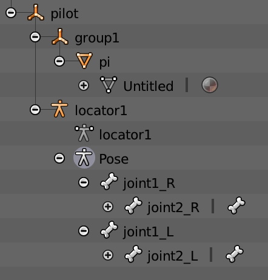

蒙皮的基本思路是，原始顶点数据处于模型局部坐标系，先变换到世界坐标系，再根据绑定时姿势，乘逆矩阵到对应骨骼局部坐标系（实际操作时这两步会合为一步）。再根据当前动画姿势，乘回到世界坐标系。

从模型空间直接变换到骨骼空间的矩阵称为boneOffsetMatrix，每对mesh和bone之间的映射关系对应一个boneOffsetMatrix，注意mesh和bone之间的关系可以是多对多的

Assimp骨骼相关的数据结构中，aiBone并非代表一根骨骼，而是代表一份mesh和一根bone之间的映射关系，boneOffsetMatrix存放在aiBone中。骨骼和场景节点都是用aiNode表示

以下图中的模型为例说明，如果网格Untitled没有被绑定到骨架locator1，则网格在场景中的的位置由节点pi，以及pi的祖先节点group1，pilot决定。否则，pi及其祖先节点的数据不纳入计算过程，网格位置由boneOffsetMatrix及骨骼信息决定

以一个网格作为输入，构建一份骨架的过程是

- 获取网格所在的场景节点，并找出该节点所有祖先节点，将节点本身和祖先假设为集合R
- 从场景根节点开始遍历，直到找到一个与网格存在绑定关系的骨骼，设为B
- 不断搜索B的祖先节点，直到找到一个节点A，其父节点FA存在于集合R内（注意A可能是B本身）
- 以A作为骨架的根骨骼，遍历A的所有后代节点，如果后代节点与网格是由绑定关系的，则将该节点加入骨架中

Shader计算中需要注意的是，对矩阵变换后的向量进行加权求和，而非对矩阵进行加权求和后再进行空间变换

动画过度混合时，才是对同一个骨骼在两个动画中的不同的矩阵数据进行加权求和，并且该过程是在CPU执行的，与顶点蒙皮无关

骨骼矩阵都属于刚体变换，不带缩放，因此对法线，次法线或切线进行变换时取3x3的旋转部分进行相乘即可