移动最小二乘公式，其中pi，qi，v为已知量，lv的参数为未知量

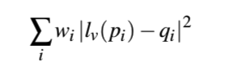 (1)
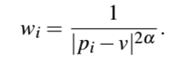 (2)

假设lv的形式，M=[m1,m2,m3,m4], T=[t1,t2]，未知量为这六个

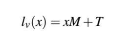 (3)

将(3)代入(1)，假设。分别求相对m1, m2, m3, m4, t1, t2的偏导数，并令结果为0，可以得到一个6元方程组，消去t1，t2，得到新的lv

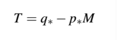 （4）

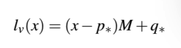 (5)

p* ,q*是pi ,pi相对v的带权重心

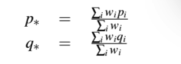 （6）

重新代入移动最小二乘公式

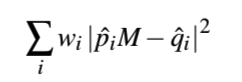 (7)

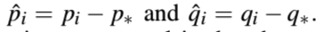 (8)

如果M是仿射变换，结果如下。注意一个向量代表的是1x2的行矩阵

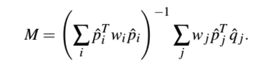 (8)

不要忘记我们的目标是求lv，最后需要把M重新代入(5)，下表a代表affine

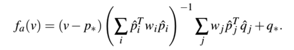 (9)


如果M是相似变换，下标s代表similarity

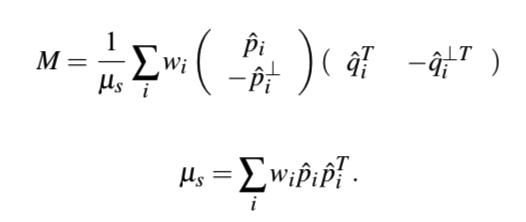 (10)

倒T代表垂直向量

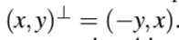 (11)

如果M是刚体变换，只需要修改相似变换中的u值，下表r代表rigid

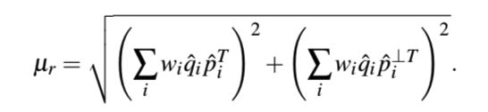


```
function mlsRigid2D(srcControlPoints, dstControlPoints, srcPoints) {
	let numControlPoints = srcControlPoints.length / 2;
	let numPoints = srcPoints.length;
	let dstPoints = [];
	let weights = [];
	let weightSum;
	for(let i = 0; i < numPoints; ++ i) {
		let pCentroidX = 0;
		let pCentroidY = 0;
		let qCentroidX = 0;
		let qCentroidY = 0;
		let vx = srcPoints[i * 2];
		let vy = srcPoints[i * 2 + 1];
		weightSum = 0;
		for(let j = 0; j < numControlPoints; ++ j) {
			let px = srcControlPoints[i * 2];
			let py = srcControlPoints[i * 2 + 1];
			let qx = dstControlPoints[i * 2];
			let qy = dstControlPoints[i * 2 + 1];
			let weight = 1 / ((vx - px) * (vx - px) + (vy - py) * (vy - py));
			weights[j] = weight;
			weightsSum += weight;
			pCentroidX += weight * px;
			pCentroidY += weight * py;
			qCentroidX += weight * qx;
			qCentroidY += weight * qy;
		}
		pCentroidX /= weightsSum;
		pCentroidY /= weightsSum;
		qCentroidX /= weightsSum;
		qCentroidY /= weightsSum;	
		let s1 = 0;
		let s2 = 0;
		let m00 = 0;
		let m01 = 0;
		let m10 = 0;
		let m11 = 0;
		for(let j = 0; j < numControlPoints; ++ j) {
			let px = srcControlPoints[i * 2];
			let py = srcControlPoints[i * 2 + 1];
			let qx = dstControlPoints[i * 2];
			let qy = dstControlPoints[i * 2 + 1];

			let dQx = qx - qCentroidX;
			let dQy = qy - qCentroidY;
			let dPx = px - pCentroidY;
			let dPy = py - pCentroidY;
			let weight = weights[j];
			s1 += (dQx * dPx + dQy * dPy) * weight;
			s2 += (dQx * (-dPy) + dQy * dPx) * weight;
			m00 += (dPx * dQx + dPy * dQy) * weight;
			m01 += (dPx * dQy - dPy * dQx) * weight;
			m10 += (dPy * dQx - dPx * dQy) * weight;
			m11 += (dPy * dQy + dPx * dQx) * weight;
		}
		let miu = Math.sqrt(s1 * s1 + s2 * s2);
		m00 /= miu;
		m01 /= miu;
		m10 /= miu;
		m11 /= miu;
		dstPoints.push((j - pCentroidX) * m00 + (i - pCentroidY) * m10 + qCentroidX);
		dstPoints.push((j - pCentroidX) * m01 + (i - pCentroidY) * m11 + qCentroidY);	
	}
	return dstPoints;
}
```