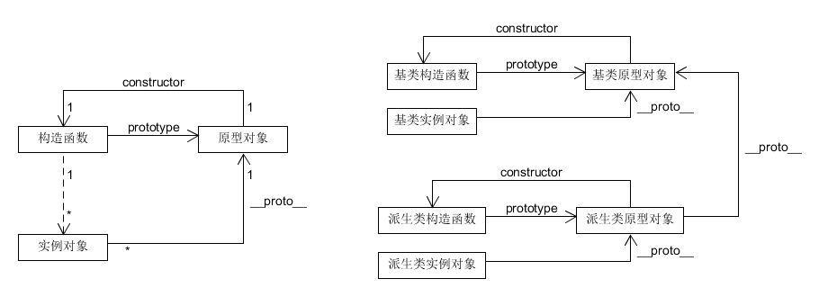

#ES 5
### 关于构造函数
构造函数只是一个普通的函数，当使用new操作符调用一个函数时，这个函数就被认为是构造函数。下面两段代码的功能是相同的

```
var o = new MyClass();
```

```
var o = {};
o.__proto__ = MyClass.prototype;
MyClass.call(o);
```
### prototype和__proto__
prototype是Function类型的属性，\_\_proto__是Object类型的属性

##工厂模式

```
function createPerson(name, age, job) {
	var o = new Object();
	o.name = name;
	o.age = age;
	o.job = job;
	o.sayName = function() {
		console.log(this.name);
	}
	return o;
}
```
缺点：没有解决对象识别的问题

##构造函数模式

```
function Person(name, age, job) {
	this.name = name;
	this.age = age;
	this.job = job;
	this.sayName = function() {
		console.log(this.name);
	}
}

var person = new Person("Nicholas", 29, "Software Engineer")

console.log(person instanceof Person) //true
```
缺点：每个方法都要在每个实例上重新创建一遍

##原型模式 + 构造函数模式


```
function Person(name, age ,job) {
	this.name = name;
	this.age = age;
	this.job = job;
}

Person.prototype.sayName = function() {
	
}

//一些oop工具库通常使用Object.defineProperty，而非直接定义属性
Object.defineProperty(Persion.prototype, "sayName", {
	value: function() {},
	enumerable: false,
	writable: true,
	configurable: true
});
```
原理类似lua的元表

#ES 6

```
class MyClass extends BaseClass {
	constructor(param) {
		//必须先初始化基类
		super(param);
	
		//定义和初始化成员变量
		this.param = param;
	}
	
	//成员函数
	myFunc() {
		
	}
	
	//静态函数
	static create(param) {
		return new MyClass(param);
	}
}
```