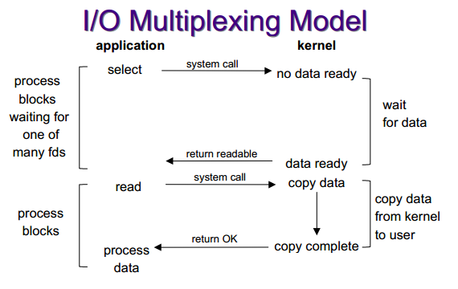
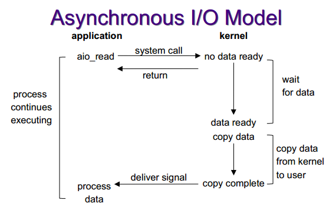

##关于同步/异步IO##
- 阻塞式IO，非阻塞式IO，IO复用和信号驱动式IO都属于同步IO，即他们最终都会在阻塞于recvfrom，sendto，read，write（读写内核数据），只有异步IO模型是在内核数据复制到用户缓冲区后才通知用户

##阻塞式IO
##非阻塞式IO
##I/O复用##
- select函数会阻塞直到多个套接字中的任意一个就绪


```
int select(int maxfdp1,
           fd_set * readset,
           fd_set * writeset,
           fd_set * exceptset,
           const struct timeval * timeout);
```
##信号驱动式IO
##异步I/O##



