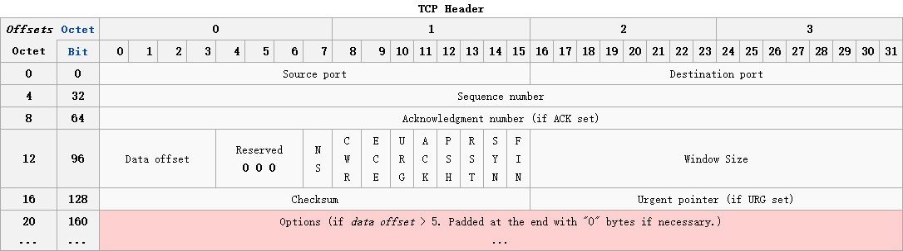

###Source port (16 bits) 源端口号
###Destination port (16 bits) 目标端口号
###Sequence number (32 bits) 序列号
- 若SYN标志位为1，则该该值为初始序列号
- 否则，该值为：初始序列号 + ？？？所占的字节数

###Acknowledgment number (32 bits) 确认号
###Data offset (4 bits) 
 - TCP头部大小，取决于套接字选项的大小，范围在20~60bytes
 
###Reserved (3 bits)
 - 保留位
 
###Flags (9 bits) (aka Control bits)
 - NS：
 - CWR（Congestion Window Reduced)：
 - ECE：
 - URG：
 - ACK：
 - PSH：
 - RST：
 - SYN（Synchronize sequence numbers）：只有在发送第一帧数据时应该标记的位，根据该位设值的不同，其他标志位值的含义可能发生改变。
 - FIN：
 
###Windows Size (16 bits) 
 - （接收）窗口（剩余可用）大小，单位字节
 
###Checksum (16 bits) 校验和
###Urgent pointer (16 bits)
###Options (Variable 0–320 bits, divisible by 32) 套接字选项
TCP套接字选项最多包括三个域

- 类型（1byte，必须）
	 + 0-End of options list
	 + 1-No operation
	 + 2-Maximum segment size
	 + 3-Window scale
	 + 4-Selective Acknowledgement permitted
	 + ...
 
- 长度（1byte，可选）：该值代表整个选项的长度，即类型+长度+数据总共占用的字节数
- 数据（变长，可选）

